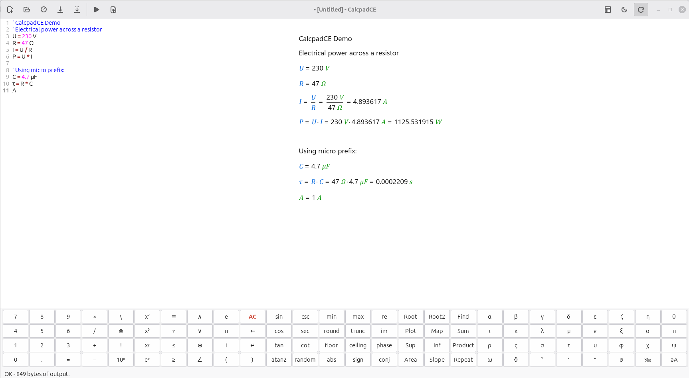

# calcpad-gui

A native GTK 4 desktop GUI for [CalcpadCE](https://github.com/imartincei/CalcpadCE),
the open-source engineering worksheet engine.

> Independent frontend: calculations are performed by the CalcpadCE CLI (Calcpad.Cli).
> This project is not affiliated with the original CalcpadCE project.

---

## ✨ Features

- GtkSourceView editor with syntax highlighting
- On-screen keyboard with Greek letters, operators & math functions
- Live HTML preview via WebKitGTK
- Light/Dark preview toggle
- Decimal-comma support
- Export to HTML, PDF, DOCX

---

## 📦 Installation

Clone repository:

```bash
git clone https://github.com/ExiMentor/calcpad_gui.git
cd calcpad_gui
```

Install dependencies:

- Linux Mint 22 / Ubuntu 24.04 / Debian 13:
```bash
sudo apt install python3-gi gir1.2-gtk-4.0 \
                 gir1.2-gtksource-5 gir1.2-webkit-6.0 \
                 dotnet-sdk-10.0
```
- Fedora 44:
```bash
sudo dnf install dotnet-sdk-10.0
```

Build Calcpad engine:

```bash
git clone https://github.com/imartincei/CalcpadCE.git
cd CalcpadCE
dotnet publish -c Release Calcpad.Cli -o ~/.local/share/CalcpadCE
```

Set environment variable:

```bash
export CALCPAD_CLI=$HOME/.local/share/CalcpadCE/Cli.dll
```

Optional permanent:

```bash
echo 'export CALCPAD_CLI=$HOME/.local/share/CalcpadCE/Cli.dll' >> ~/.bashrc
source ~/.bashrc
```

---

## 🚀 Usage

```bash
python3 -m calcpad_gui
```

---

## 📸 Screenshots



---

## 📄 License & Credits

This project is released under the MIT License.

This application builds upon the CalcpadCE ecosystem, which originates from the original Calcpad application developed by Ned Ganchovski (2014–2026).

CalcpadCE is an open-source continuation of this work, maintained by the CalcpadCE contributors.

This GUI uses CalcpadCE as an external calculation engine and does not include its source code.
